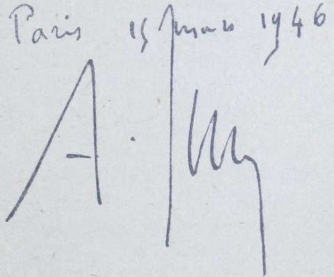

# Préface du général Juin

1891 – Lyautey est depuis deux ans capitaine, commandant le 1^er^ escadron du 4^ème^
chasseurs à cheval à Saint-Germain-en-Laye. Il a trente-six ans. C’est l’époque
du *Ralliement*. Avec sa flamme habituelle, il se mêle au mouvement d’union, à
cette « Période de bonnes volontés » dont le pape Léon XIII vient de donner le
signal. Pour Lyautey, la préoccupation du devoir social n’est pas neuve. À
Saint-Cyr, il a noté la forte impression rapportée d’une conférence sociale.
« Notre rôle est sacré » écrit-il ensuite avec ferveur. Plus tard, à Florence,
méditant sur le destin d’un seigneur de la Renaissance dont il possède le
portrait « L’épée au côté, la main posée sur un livre », il envie ce jeune
capitaine. Un beau guerrier, songe-t-il, mais sans doute éclairé et instruit, et
qui, sûrement, employait ses loisirs, entre deux combats, à deviser des affaires
de la République. À tout instant, sous sa plume, reviennent les phrases qui
témoignent de sa hantise ; rapprocher les êtres, les unir au sein de la société.  
À Saint-Germain, le contact avec la troupe, les responsabilités du commandement
réveillent et affermissent sa conviction : l’officier a une autre mission à
remplir que celle d’enseigner le tir et l’équitation à des hommes dont il ignore
même les noms. Il se met au travail avec la double préoccupation de voir large
et grand sans négliger aucun détail. La recherche d’une composante harmonieuse
entre ces deux préoccupations sera la marque de son génie et le secret de ses
réussites. Penché avec passion sur la vie collective de cet escadron qui est sa
famille, il transforme d’abord le réfectoire en un cercle, un cercle dont
l’administration sera confiée à une commission élue par les hommes. D’autres
initiatives non moins hardies, au risque d’ébranler les bases du sacro-saint
règlement, viennent modifier l’instruction, dont les caractères seront
l’entrain, l’intérêt, la gaîté. « Pas de formations en rang continuelles, mais un
ralliement perpétuel derrière le guide ». Tout Lyautey est là. C’est avec les
mêmes mots directs, avec le même accent joyeux qu’il travaillera toute sa vie,
jamais seul, mais toujours entouré de l’équipe jeune, allègre et confiante sans
laquelle il ne peut vivre.  
En 1891, dans l’armée, encore si profondément marquée par nos revers, de telles
idées étonnent par leur audacieuse nouveauté. C’est alors que des amis, comme
E.-M. de Vogüé, engagent le capitaine Lyautey à faire un exposé écrit de
l’action qu’il mène journellement. L’article parait dans la *Revue des
Deux-Mondes* du 15 mars 1891. Son retentissement, dans les milieux intellectuels
surtout, est considérable.  
Je viens de le relire. Une foi ardente s’en dégage, sous le style volontairement
froid et contenu. J’évoque, à mon tour, la silhouette mince du capitaine de
cavalerie Hubert Lyautey, « le sabre au côté et la main posée sur un livre ».
C’est déjà le Lyautey avide d’action et tout frémissant d’idées et d’espoirs
généreux que je devais rencontrer plus tard au Maroc – mais un Lyautey encore au
stade des virtualités et en quête de son destin.  
Les directives données par Lyautey ont-elles été suivies ? Ont-elles conservé
leur valeur ? Quels résultats, quels fruits ont-elles donnés ? Telle est la
question qui viendra sans doute à l’esprit du lecteur de l’ouvrage, que de
pieuses mains viennent de replacer sous ses yeux.

Ne nous arrêtons pas au spectacle du jour : celui d’une France victorieuse, mais
toute meurtrie et divisée dans un monde en voie de bouleversement. Le progrès a
de redoutables reflux.  
Notons d’abord qu’en 1891, Lyautey, quoiqu’il en dise, fait figure de
précurseur, et même d’inventeur. Les uns admirent, les autres critiquent son
audace. Jamais programme plus imprévu n’a été proposé à notre corps d’officiers.
Le choc est vif, presque rude.  
Ses chefs d’alors, tous formés comme jeunes officiers dans les guerres du Second
Empire, restent persuadés que l’armée française sera toujours de belle pâte et
que si elle a été battue en 1870, c’est uniquement parce qu’elle a été mal
conduite. Aussi bien, ne sont-ils préoccupés que de l’aspect technique des
choses de la guerre. Le côté moral leur importe peu : une bonne discipline doit
suffire. Ils ne voient dans les idées de Lyautey qu’originalité d’esprit et sont
prêts à s’apitoyer sur le cas de ce jeune et brillant officier de l’ancien corps
d’État-Major, qui paraît s’être dévoyé.  
Lyautey en a conscience et, réfractaire, il s’évade. Toute sa vie, il aura des
mots amers contre les « Kriegspielards » incapables de rien saisir au-delà du
cercle étroit des thèmes tactiques et des règlements militaires où ils se sont
enfermés.

Et pourtant, le message du futur maréchal a été entendu : un état d’esprit est
né. C’est ce qu’il souhaitait. Les classes appelées par la mobilisation, le 2
août 1914, ont été, semble-t-il, instruites par une génération d’officiers plus
humains, plus sociaux. Encadrées par un nombre croissant d’officiers de réserve,
qui associaient leurs camarades de l’active à de nouvelles préoccupations.
L’armée de la Marne, celle de Verdun, celle surtout de nos offensives
victorieuses, après le redressement de 1917, a été unie et fraternelle. Dans la
boue des tranchées, le bon grain semé vingt-cinq ans plus tôt a levé. Il a donné
de splendides gerbes, trop rouges hélas du sang des sacrifices qui rassemblaient
officiers et soldats, Saint-Cyriens en gants blancs et jeunes instituteurs ou
agrégés aux opinions parfois très avancées, ouvriers, savants, paysans,
écrivains et poètes.  
La troupe a bien vu ses chefs « partager sans atténuation ses privations et ses
fatigues ». Et « la confiance, la gratitude, la sollicitude affectueuse » et
réciproque que Lyautey appelait de toute sa conviction, n’ont certes point
manqué au rendez-vous sur les champs de bataille, preuve qu’elles n’étaient
point absentes au quartier ou à la caserne.  
De purs visages, un Péguy, un Ernest Psichari, un Guynemer, tant de jeunes
existences fauchées une chanson aux lèvres, un cher espoir au cœur, une grande
idée en tête ; des gens venus de tous les horizons, rapprochés par la misère et
la gloire dans une camaraderie totale, plus sainte que bien des amitiés, voilà
le bilan de cet esprit de compréhension tolérante qui fut la parure de notre
armée, durant les longs jours d’épreuve comme au soir de la victoire.

À l’inverse, la bataille de 1940 a été perdue sans doute par défaut de
préparation, sans doute aussi par défaut d’imagination, celle-ci ayant été
bannie de nos collèges militaires, entre les deux guerres, par crainte de voir
porter atteinte à la doctrine qui nous avait procuré la Victoire. En vérité, le
ressort s’était détendu au cours des années de renoncement et de facilité qui
ont précédé la guerre de 1939.  
Mais de même qu’une grande nation ne saurait disparaître sur un coup de dés, de
même il ne saurait suffire d’une seule bataille pour effacer les traditions
glorieuses d’une armée fondées sur des siècles d’Histoire. La France privée de
liberté, devait très rapidement retrouver son souffle guerrier et la jeune armée
renaissante de la libération, celle qui, du Tchad au Rhin et au Danube en
passant par Tunis et par Rome, a reconquis notre sol et ressaisi la gloire,
celle-là fut bien telle que l’eût désirée Lyautey.  
Pour s’en convaincre, il n’est que d’avoir vu nos jeunes équipages sur leurs
chars ou leurs avions, gradés et hommes de troupe étroitement soudés, pensant et
agissant avec la précision d’un mécanisme harmonieux. L’arme moderne est
complexe. Elle requiert une équipe. Elle exclut les individualismes. Elle
n’admet l’initiative personnelle qu’au service de l’ensemble. La vieille
infanterie elle-même en est toute transformée. Le groupe de combat part à
l’attaque avec ses grenadiers, ses mitrailleurs, ses pourvoyeurs, ses radios,
son artilleur, suspendu, haletant, à la progression de la première vague, et en
arrière, ses services innombrables apportant vivres et munitions, évacuant les
blessés, dégageant les routes, reconstruisant les ponts. Tout ce monde est animé
d’une ardente vie collective, articulée comme les rouages d’une immense usine.
Dans ce creuset où se fondent les origines, l’officier n’ignore ni l’âge, ni la
situation de famille, ni l’état de santé, ni la profession de celui à qui il
confie par exemple les commandes d’un char de 40 tonnes. Il connaît ses
réflexes, il a sondé son cœur, éprouvé ses nerfs, lu dans ses yeux. Le résultat
du combat, souvent bref comme l’éclair, parfois étiré au long de jours et de
nuits interminables, est au prix de la résistance de chacun et de tous,
résistance au choc, résistance à la faim, à la soif, au sommeil, résistance à la
promiscuité où se dissolvent tant de courages. Malheur à l’homme seul ! Et
malheur, par conséquent, au chef qui, avant la bagarre, aura omis de se pencher
longuement, affectueusement, sur le moral de sa troupe.

L’armée a si bien compris l’importance du problème qu’elle s’est assuré la
collaboration de techniciens. Le service social militaire est né. L’organe, tout
récent, cherche encore sa voie. Il n’a pas reculé devant une innovation
audacieuse et qui paraissait répondre à un besoin, puisqu’elle a été acceptée,
parfois devancée, par tous les commandants de nos grandes unités. Il a fait
appel aux femmes. Lyautey lui-même n’aurait pas été peu surpris s’il avait
aperçu, sur les routes d’Italie ou d’Allemagne, nos assistantes sociales,
souvent de très jeunes filles, casquées et vêtues comme les soldats, parcourant
sur leurs jeeps rapides, les arrières bombardés de nos troupes. Recherche
d’identification des grands blessés dans les formations sanitaires,
correspondance avec les familles inquiètes ou en deuil, règlement des
difficultés soulevées au loin par la maladie ou la carence de la mère,
organisation de foyers et de centres de repos, affrètement de camions-bazars,
leur activité a été variée, leur présence presque toujours salutaire et
réconfortante. Il est un peu tôt cependant pour tirer les conclusions de
l’expérience qui vient d’être tentée. Sans doute, comme dans la plupart des
institutions humaines, le succès sera-t-il fonction de la qualité de ceux et de
celles qui auront à charge de l’assurer.

Ce qu’il ne faut pas, c’est que l’officier s’en remette au spécialiste et cesse
de se préoccuper du moral sous le prétexte qu’un bureau y pourvoit. On n’envoie
pas les cœurs à l’atelier, pour révision, comme l’armement. Le service social
doit être, comme le service médical, à la disposition du commandement. Son rôle
sera de prévenir, de rechercher des moyens et de proposer des solutions, mais
surtout de réaliser les intentions du chef, c’est-à-dire du responsable de la
troupe au combat, de celui qui partagera, au moment suprême, son ardeur ou sa
crainte, ses espoirs et ses risques.

***

La guerre a pris fin sur l’apparition apocalyptique de puissants moyens de
destruction qui bouleversent complètement les données de la sécurité future.
Alors que la règle du jeu consistait naguère, pour se protéger, à mettre en
place, à la frontière, une masse aussi dense que possible de combattants pourvus
d’armes efficaces mais d’un usage à peu près courant dans toutes les nations, il
faudra s’attendre désormais aux terrifiants effets de surprise d’armes tenues
secrètes et capables, en quelques jours et non en quelques heures, de provoquer
une paralysie générale.  
Devant de tels dangers, parades et ripostes seront fonction des martingales plus
ou moins connues de l’ennemi et des armes que nous aurons forgées. D’où un
effort constant de recherche et de mise en condition de façon à pouvoir
disposer, le moment venu, de l’instrument militaire le plus adéquat.  
Cette armée future sera-t-elle « de métier » ou « populaire » ? Ce sont là, en
vérité, des expressions qui ont perdu tout leur sens après la douloureuse
épreuve que nous venons de subir. Quand la guerre revêt les aspects que nous lui
avons connus et qu’elle devient réellement totale en faisant le plein des
horreurs, on peut affirmer que l’ère est bien close de ces gladiateurs ou
mercenaires sur lesquels on pouvait se reposer jadis du soin de défendre le
pays. À la guerre totale, dont les coups se feront sentir jusque dans les
profondeurs les plus intimes et les plus reculées de la nation, il faut
nécessairement répondre par une mobilisation totale. C’est à la nation tout
entière qu’il appartient désormais de se dresser et de se tendre dans l’effort
de conservation, et l’on ne saurait concevoir, dans ces conditions, que son
armée ne fût pas « nationale ».  
Au reste, la III^ème^ République, entrée résolument dans cette voie après 1870, a
pu, au lendemain de la première guerre mondiale, s’enorgueillir de l’armée
qu’elle avait créée et qui avait triomphé en raison précisément de son caractère
national.  
Les cadres permanents de cette glorieuse armée d’hier n’ont jamais constitué une
caste à moins qu’on n’entende par ce mot un groupement de spécialistes se
différenciant des autres hommes par les façons de penser et d’agir propres à
leur métier. À ce titre, les castes seraient innombrables. Les officiers se
recrutaient dans toutes les couches sociales, et qu’ils sortissent du rang ou
des écoles, de la rue des Postes ou des lycées nationaux ouverts aux plus
humbles par les libéralités de la République, leurs droits étaient les mêmes,
garantis par un vieux statut qui inspirait confiance. Au sein des corps où ils
étaient versés, leur fusion s’opérait sans dissonances et sans heurts par la
vertu d’une camaraderie de métier qui était de règle et faisait table rase des
préjugés de milieu et des partis pris de l’opinion. Sans doute arrivait-il que
les meilleurs ne fussent pas toujours à leur place. En temps de paix les
militaires ont rarement l’occasion de donner la mesure de leur caractère et de
leurs réflexes. Il faut les circonstances exceptionnelles de la guerre, les
coups durs et l’épreuve des responsabilités, pour qu’apparaissent ces signes à
quoi l’on reconnaît ceux qui sont vraiment des chefs. Sans doute, aussi,
arrivait-il à quelques-uns d’entre eux, trop sédentaires, de s’abandonner par
lassitude ou par routine aux règles d’une vie communautaire qui pourvoyait à
l’essentiel et de ne plus avoir aucun contact avec la vie sociale extérieure.
C’est qu’il faut avoir une réelle force d’âme pour garder, dans une paix qui se
prolonge, ses ressorts constamment tendus vers d’hypothétiques batailles. À
répéter journellement des exercices de petite guerre, c’est-à-dire de fausse
guerre, certains finissent par avoir la sensation de tourner à vide et par
désespérer de connaître jamais les minutes de grandeur qui doivent les payer de
tant d’années de servitude. Parmi ces tourmentés, il en est qui abandonnent et
s’évadent, mais la majorité demeure, résignée, marquée d’un complexe
d’infériorité.  
C’est contre de tels engourdissements qu’il faut lutter et à cet égard nous ne
saurions trouver de leçon plus profitable que celle donnée par Lyautey. Lui
aussi fut un grand tourmenté et lui aussi prit le parti de l’évasion, mais sans
renoncer pour autant à l’uniforme. Ayant découvert sa voie, il devint créateur
d’action, non seulement pour lui-même mais pour tous ceux qui l’entouraient.
Dans le sillage lumineux de ce magicien qui prêchait d’exemple et bâtissait sans
cesse dans l’universel et dans le concret, les militaires de carrière
retrouvaient une âme et des raisons de s’employer hors des occupations
proprement guerrières qui ne sont que fortuites et humainement peu souhaitables.

Lyautey avait parfaitement compris qu’en répandant à pleines mains, comme il le
faisait, les semences de la grandeur française, il semait en même temps autour
de lui des germes de vie et de fierté. Habile manieur d’hommes il avait l’art de
les utiliser selon leur valeur qu’il appréciait d’un œil sûr. Ce grand seigneur
hautain et traditionaliste, qu’on aurait pu croire dédaigneux du vulgaire,
allait d’instinct aux meilleurs qu’il s’attachait sans considération d’origine
ni de grade et qu’il élevait au premier rang par l’affection et les égards qu’il
leur témoignait.  
Dieu veuille qu’on s’inspire de sa manière à l’heure ou se pose le problème de
la reconstitution des cadres et des équipes dirigeantes de notre armée.  
Notre Patrie ne peut se survivre qu’avec une armée qui soit une élite d’où la
nécessité pour la refaire de puiser largement dans le fonds national des
intelligences et des caractères. Que son accès comme celui de nos grandes
administrations, soit de plus en plus largement ouvert. Mais qu’une fois
choisis, dans un esprit de parfaite équité, au sein de toutes les couches
sociales, parmi les plus aptes et les plus dignes, nos officiers reçoivent
l’instruction et l’éducation qui les préparent à leur noble tâche. L’armement
moderne exige une formation technique qui passe de loin la sommaire culture
scientifique autrefois suffisante. Le devoir social impose une préparation
morale conçue dans la ferveur, dispensée dans l’enthousiasme. La gaieté n’en
sera point exclue. Mais elle répudiera tout scepticisme. Elle se libérera de
l’excès de sens critique qui empoisonne aujourd’hui les réactions de trop de
jeunes Français et les porte insensiblement à la sécheresse de cœur et à
l’inaction. Elle sera basée sur le respect et sur la confiance : respect de la
personne du chef, respect de ses enseignements, confiance aussi bien dans les
vertus créatrices que dans les aspirations à l’union et à la discipline,
latentes au fond du tempérament français.

***

C’est seulement à ce prix que nos officiers pourront aborder la seconde partie
de la mission, d’intérêt général celle-là, que leur assignait Lyautey : « *à
l’état de guerre haineuse et violente qui sépare stérilement les enfants du même
sol, de parti à parti, de classe à classe, substituer la recherche pacifique et
féconde des problèmes posés par la révolution économique et industrielle de ce
temps ; marcher ; non plus la revendication ou la répression au poing, mais la
main dans la main, dans la large voie du progrès social… Question non pas
vieille comme le monde*, ajoutait-il, *mais posée d’hier, dans son acuité* ».

On se rappellera que ces lignes sont écrites en 1891. Elles témoignent chez leur
auteur d’une maturité de pensée singulière. En quelques mots d’une trempe
vigoureuse, c’est tout le problème social dans la société moderne qui est posé.
Au reste, l’article tout entier a l’accent des œuvres magistrales qui viennent à
leur heure et que le temps n’atteint pas.  
Durant toute sa vie, Lyautey, penché sur la France, a percé à jour les périls
qui la menacent. Il a mesuré l’ampleur de la révolution économique et
industrielle qui bouleverse le vieux monde libéral. Il a pressenti
l’interdépendance et la priorité respective, dans un ordre hiérarchique qu’il
serait vain de vouloir éluder, des trois problèmes : politique (dans le sens
noble du mot), économique et social. Plus tard, quand il a voulu ranimer et
régénérer le vieux Maghreb, en faire un des plus beaux fleurons de l’Empire, ses
plans de mise en valeur du protectorat n’ont cessé de s’inspirer de ce grand
principe.  
Tous les malentendus, toutes les contradictions de notre époque paradoxale, il
les a conçus, avant que ne les aient circonscrits bien des économistes
professionnels qu’il côtoyait dans le monde. N’a-t-il pas, le premier, procédé à
certaine nationalisation qu’il jugeait indispensable ? Il avait prévu que les
progrès démesurés de la science auraient pour conséquence une augmentation
illimitée de la production, que le régime qui s’éteint serait incapable
d’organiser une juste répartition de ces richesses fabuleuses. Il savait que des
convulsions graves pourraient naître de ces antagonismes. Combien de fois
n’a-t-il pas lancé son cri d’alarme, estimant qu’il était temps encore de
discipliner notre vie nationale, de la réformer, afin de « *rendre l’homme enfin
réfractaire aux excitations de la lutte des classes* ».  
Cet appel qu’il adressait particulièrement à ses pairs, il a été entendu et
compris à l’intérieur de l’armée, en vue de l’utilisation de l’armée. Mais
Lyautey avait demandé davantage. Il aurait voulu que le bénéfice de l’éducation
reçue au régiment se prolongeât au delà du service militaire. C’est pourquoi il
avait proposé aux officiers – agents de l’État investis d’une mission très
spécialisée – un programme d’action morale universelle dépassant largement leur
fonction militaire.

Il était inévitable qu’une telle doctrine parût audacieuse et heurtât les
consciences, en apposant les notions de liberté et de discipline. Nous savons du
reste, que des temps troublés peuvent survenir où il est plus difficile de
connaître son devoir que de le suivre. Comment alors mêler l’officier aux
conflits d’idées qui opposent dans une démocratie les citoyens les uns aux
autres sans risquer de diviser l’armée elle-même aux heures des grandes
décisions ?  
Lyautey connaissait le danger et en avait pris son parti. Sans doute, s’il avait
vécu, aurait-il encore renforcé sa manière de voir. Les notes qu’il a prises au
cours de ses dernières années le prouvent.  Quels que soient les obstacles à
surmonter, l’officier ne saurait se désintéresser de la formation morale, donc
sociale de ses hommes. Mais il devra le faire avec la prudente réserve qui
s’impose vis à vis de la discipline dont aucune armée au monde ne saurait se
passer et de l’intérêt national qui doit demeurer le seul guide.  
C’est dans cet esprit que les instructeurs de nos futurs officiers pourront et
devront se conformer aux directives de Lyautey. Mais leur action demeurera
lettre morte si le jeune soldat n’a pas reçu, avant son entrée au régiment, un
commencement d’éducation civique. S’il entre à la caserne avec des préjugés, un
patriotisme chancelant, une notion erronée de la discipline, un sens moral déjà
dévoyé, la tâche du chef sera quasi impossible.

Lyautey l’avait bien senti puisqu’il terminait son article par une adjuration
adressée aux éducateurs. L’école doit préparer au régiment. Alors, le régiment
pourra succéder à l’école, sans malentendu, sans heurt ni contradiction. Ce
n’est plus un mystère que chez nous, l’éducation du citoyen reste à faire. La
démocratie l’appelle et l’exige. À défaut, la liberté dégénère en licence,
l’ordre public est troublé, l’autorité bafouée. Aucune construction politique,
aucune doctrine économique, aucun régime social, même le plus généreux, ne
vaudront si le citoyen fait un usage insensé de la parcelle de souveraineté dont
il dispose. L’intérêt national n’a que trop souffert de ce manque d’éducation.
Il est grand temps d’y songer si l’on veut empêcher le pays de rouler aux
abîmes.  
Or, à l’école, le caractère de l’enfant n’est point encore assez formé, assez
mûr pour lui permettre d’aborder l’étude des problèmes sociaux. Au contraire,
parvenu à l’âge d’homme, réuni au régiment à des camarades de tous les milieux
et de toutes les origines, il sera plus apte à comprendre et à apprendre sa
mission civique au sein de la communauté française.

***

Dans la paix retrouvée, nos officiers vont donc pouvoir à nouveau méditer les
exhortations du capitaine Lyautey. Qu’on ne les laisse pas s’endormir dans la
monotonie de la vie de garnison. Une tâche pacifique, que le futur maréchal
entrevoyait plus grande et plus belle que leur mission guerrière, s’offre
aujourd’hui à eux dans des circonstances qui la font plus noble et plus
nécessaire encore que naguère. Qu’ils y réfléchissent et qu’ils ne s’y dérobent
point.  
Et puis, qu’ils aient bien dans l’esprit que le sort de notre pays ne se joue
pas nécessairement entre sa frontière du nord-est et Paris, sa capitale. Que
leur regard, franchissant les mers, mesure la force française à l’échelle de
l’union française et la mesure aussi bien sur le plan des ressources que sur
celui des positions.  
Au cours de sa longue et féconde carrière coloniale, Lyautey avait déjà appelé
l’attention sur les virtualités militaires de l’Empire et le surcroît de force
que la France en pouvait tirer, à condition qu’elle s’en donnât la peine.
L’article qu’il a consacré au rôle colonial de l’officier, sans avoir eu le même
retentissement que celui traitant du rôle social, n’en a pas moins porté ses
fruits.  
Des générations de jeunes officiers, prosélytes ardents et désintéressés comme
des missionnaires de la foi, l’ont suivi dans cette voie si lumineusement
tracée. On leur doit ces glorieuses phalanges qui ont fait merveille sur tous
les fronts. Seuls, des officiers français ont pu accomplir ce miracle de
s’attacher par le cœur des combattants de toutes races et de toutes couleurs et
de les entraîner sur les champs de bataille les plus reculés du monde par la
seule vertu de l’exemple et du dévouement qu’ils savaient inspirer.  
En 1914-1918, la contribution de l’Empire largement consentie par Lyautey
lui-même au Maroc, malgré l’inachèvement de la pacification, avait pesé de tout
son poids dans nos batailles et dans nos victoires. En 1940, si les facultés
d’imagination et le sens impérial paraissent avoir été obnubilés chez la plupart
des Français par la soudaineté de la défaite, il n’en demeure pas moins que
c’est dans l’Empire dont les positions essentielles, et particulièrement celles
de l’Afrique du Nord, furent sauvegardées que se sont ressoudés les tronçons de
notre épée.

En choisissant de reposer en terre lointaine parmi les tombeaux des grands
barbaresques dispersés à Rabat sur les bords de la mer océane, Lyautey avait
pressenti ce destin et voulu que, lui disparu, les Français eussent sous les
yeux un signe de foi et de ralliement quand viendraient les temps désespérés.  
Aux jours sombres de 1940, un homme a déchiffré ce symbole. C’est le général de
Gaulle. Faisant sienne la voix d’outre-tombe il a, de son doigt tendu vers
l’Empire, indiqué la voie du redressement national. Disciple inconnu de Lyautey,
il est aujourd’hui celui qui l’a le mieux compris, et s’en est le plus rapproché
à un moment décisif de notre Histoire.  
L’armée qui a jailli, comme par miracle, des profondeurs de l’Empire comptera
parmi les plus belles que la France ait jamais eues. Elle a frappé d’étonnement
et d’admiration le monde entier, non seulement par son incomparable tenue au
combat, mais par l’exemple d’une fidélité que des années de malheur n’avaient pu
entamer.  
Dans ses rangs, contingents autochtones et mobilisés français, confondus dans
les mêmes sacrifices et les mêmes fiertés, se sont retrouvés plus unis que
jamais, donnant ainsi la preuve que c’est au sein de l’armée que les différentes
races servant sous nos couleurs se sont toujours le mieux comprises et le plus
aimées.  Donc, Lyautey avait raison et les officiers qui l’ont suivi et donné le
meilleur d’eux-mêmes pour s’attacher leurs tirailleurs et les entraîner au
combat, avaient, eux aussi, raison. À ceux qui restent ou qui viendront, de
suivre leur exemple et de se montrer vigilants à l’heure où, profitant de notre
faiblesse et de nos erreurs, le doute et la convoitise commencent à se glisser
dans certains esprits. Il y va de la cohésion de l’Empire et de notre propre
salut dans la paix traversée d’inquiétude où nous entrons.

Paris 15 mars 1946 A. Juin

