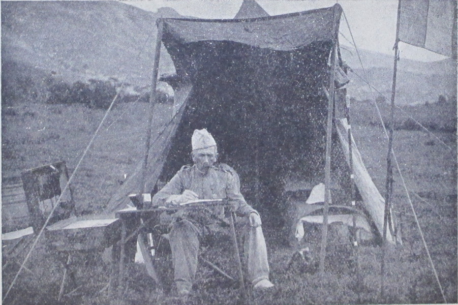

## Du rôle social de l’officier dans le service militaire universel

> Le service militaire universel jouera un rôle décisif dans notre
  reconstitution sociale. Le legs de la défaite, le lourd présent de l’ennemi,
  peut être l’instrument de notre rédemption. Nous ne sentons aujourd’hui que
  ses charges : j’en attends des bénéfices incalculables : fusion des
  dissidences politiques, restauration de l’esprit de sacrifice dans les classes
  aisées ; de l’esprit de discipline dans les classes populaires, bref toutes les
  vertus qui repoussent toujours à l’ombre du drapeau.  
  (E.-M. de Vogüé. Remarques sur l’exposition du centenaire.  
  Plon-Nourrit, 1889, p. 282).

Les hommes que leurs occupations ou leur vocation mettent en contact avec la
jeunesse cultivée s’accordent à signaler, dans la génération qui naît à la vie
publique, certain courant de réaction contre le dilettantisme qui a plus
particulièrement marqué ses devancières. En présence de la transformation
sociale, dont la marche grandissante et la fatalité forcent aujourd’hui
l’attention des esprits les plus rebelles, cette jeunesse s’aperçoit, nous
affirme-t-on, que, pour les privilégiés de l’esprit, il peut y avoir d’autres
rôles que ceux d’analystes et d’expérimentateurs et qu’il est peut-être temps de
sortir de la critique ou de la spéculation sereines pour en venir à l’action
rude et féconde.  
Pour ne citer que quelques noms parmi les guides écoutés de la jeunesse, trois
hommes, éloignés d’origine et d’esprit, mais que bien de nobles traits
rapprochent, M. Albert de Mun, M. Melchior de Vogüé, M. Ernest Lavisse, ont
reconnu cette bonne volonté, ce besoin de groupement pour une action commune, et
s’efforcent de le féconder.  
Le premier, pénétré de la gravité croissante de la question ouvrière et
convaincu que seul le retour du peuple au christianisme en donnera la solution,
groupe autour de lui la jeunesse catholique militante. C’est aux futurs
ingénieurs, aux futurs industriels, aux futurs patrons qu’il demande leur
concours et encore à ceux-là seuls auxquels une foi commune permet de s’associer
à son œuvre ; c’est par la force des choses, parmi les élèves des établissements
religieux que se recrutent presque exclusivement ses adhérents.  
Le dernier exerce son ascendant incontesté sur la nombreuse jeunesse
universitaire ; il a développé chez elle le sentiment de la solidarité, auquel il
a donné une forme dans les associations d’étudiants. En contact permanent avec
elle, il lui enseigne le patriotisme actif, l’union généreuse, le devoir social ;
il s’adresse avant tout aux futurs professeurs par qui son influence s’étendra
sur la jeunesse de demain.

Entre les deux, M. de Vogüé à qui, d’une part, son nom et ses origines, d’autre
part son talent d’écrivain et son sens très vif des grandeurs de notre temps
donnent accès dans tous les camps (puisque camps il y a, hélas) s’est fait une
large place. Se dégageant des questions de parti qui, dès le berceau scindent
aujourd’hui la nation en deux, des formules politiques, des étiquettes d’école,
il s’est placé sur le terrain commun de l’action sociale. À tous les privilégiés
de l’intelligence, de l’éducation, de la fortune, il rappelle que leurs premiers
devoirs sont envers les humbles et les déshérités et convie les bonnes volontés
de tous partis, de toutes confessions, de toutes philosophies, à communier dans
la « religion de la souffrance humaine ».  
Tous, ils ont réveillé dans cette jeunesse le sens de l’action ; tous, sans
l’entendre peut-être de la même manière, ont placé au premier rang le devoir
social. En montrant la grandeur du but, ils n’ont pas dissimulé les épreuves du
chemin, les préjugés à vaincre, les routines à briser, et, dès qu’il s’agit
d’aller au peuple, la difficulté de l’aborder et de le convaincre, pour qui n’en
porte pas le vêtement et n’en parle pas la langue, si profonde est la méfiance
contre la parole des dirigeants qu’inspire aux travailleurs l’opposition
apparente de leurs intérêts matériels.  
Sans nul doute, il y a là un mouvement, un souffle de dévouement et de
générosité. Il semble que cette génération prenne conscience du grand rôle
qu’elle pourrait remplir. Et quel rôle ! À l’état de guerre haineuse et violente,
qui sépare stérilement les enfants du même sol, de parti à parti, de classe à
classe, substituer la recherche pacifique et féconde des problèmes posés par la
révolution industrielle et économique de ce temps : marcher, non plus la
revendication ou la répression au poing, mais la main dans la main, dans la
large et noble voie du progrès social. Et qu’on ne dise pas que, sous cette
forme, c’est là une question vieille comme le monde ! Dans son acuité, elle est
posée d’hier et c’est d’hier aussi que la science, l’industrie, en leur
évolution foudroyante, ont apporté pour la résoudre d’autres éléments que le
pétrole et la dynamite.

Mais, si nombreux que soient les jeunes gens, étudiants, futurs ingénieurs,
futurs industriels, futurs patrons, futurs professeurs, à qui s’adressent ces
protagonistes du devoir social, chacun de ces groupes n’agira que sur un nombre
restreint d’individus et leur ensemble même ne peut rencontrer la totalité des
travailleurs tant s’en faut.  
N’existe-t-il donc pas un « cadre », dans l’acception militaire du terme,
capable par nature d’exercer une action plus étendue que les autres et, si ce
cadre existe, n’est-il pas le premier à pénétrer de la nécessité et de l’urgence
du devoir social ?  
Ce cadre est tout formé, destiné par son essence à exercer la direction
temporaire, non pas seulement d’une fraction, de la majorité même, mais de la
totalité de la jeunesse ; c’est le corps des vingt mille officiers français.

Depuis l’application intégrale du service obligatoire, c’est-à-dire depuis hier,
c’est, de vingt à vingt-trois ans, toute la nation sans exception qui passe
entre ses mains ; nul n’y échappe. Il ne s’agit plus ici de tel ou tel groupe de
travailleurs ; tous, ouvriers de la main et de la pensée, lettrés et ignorants,
propriétaires et laboureurs, reçoivent, pendant une période de leur vie,
l’empreinte d’un lieutenant, d’un capitaine, d’un colonel.  
À ce fait tout nouveau – ce fait révolutionnaire au sens propre du mot – doit
répondre forcément un développement du rôle de l’officier dont lui-même n’a,
croyons-nous, pas encore pris conscience ; dont, en tout cas, il ne nous semble
pas qu’on ait été suffisamment frappé au dehors.

Depuis vingt ans, une succession de régimes transitoires, – service de cinq ans
intégral, service de quarante mois, volontariat de plus en plus restreint,
congés de plus en plus étendus – a préparé le régime actuel ; mais, entre le
dernier contingent d’une année où le remplacement épargnait le service à tout ce
qui avait quelque culture et ce contingent de 1890 qui, du licencié à
l’illettré, va comprendre tous les intermédiaires, la « matière-soldat » si l’on
peut dire, a radicalement changé. À ce soldat nouveau, il faut logiquement un
officier nouveau. C’est celui dont nous allons essayer de tracer la mission et
c’est à ce point de vue initial qu’il faudra constamment se reporter pour ne pas
se troubler d’une conception du rôle de l’officier qui s’éloignera peut-être du
type un peu rude et exclusivement batailleur que ce nom, à tort ou à raison,
avait le don d’évoquer.

Nul n’est mieux placé que l’officier pour exercer sur ces subordonnés une action
efficace. En contact immédiat avec eux, il partage entièrement leurs travaux,
leurs fatigues et n’en tire néanmoins aucun profit. Son gain ne dépend pas,
comme celui des industriels, de la peine de ses hommes. Leurs intérêts sont non
plus opposés, mais semblables. L’autorité dont il est investi repose sur la loi,
elle a une sanction légale, elle échappe à toute discussion, à tout compromis.
Des règlements précis fixent la limite de ses exigences professionnelles. Tout
concourt à dégager son indépendance personnelle et le désintéressement de son
action.  
C’est donc un merveilleux agent d’action sociale. Quel intérêt n’y aurait-il
pas, si l’on se place au point de vue d’où nous sommes partis, à ce qu’avant
tout autre, il fut animé de l’amour personnel des humbles, pénétré des devoirs
nouveaux qui s’imposent à tous les dirigeants sociaux, convaincu de son rôle
d’éducateur, résolu, sans rien modifier _à la lettre_ des fonctions qu’il
exerce, à les vivifier par _l’esprit_ de sa mission ?  
Et pourtant, il est le seul à qui l’on ne songe pas. Ceux qui poussent la
jeunesse dans les voies de l’action sociale ne prononcent pas son nom ; on ne
semble pas imaginer qu’on puisse utiliser cette force puissante ; on ne se
demande pas si le mouvement qui secoue la génération nouvelle ne pourrait être
propagé dans le milieu militaire.

Pourquoi cet oubli ?

C’est peut-être la vieille prévention des hommes de pensée contre les gens
d’épée, disons même contre tous ceux qui pratiquent l’action physique puisque,
depuis l’antiquité, le sens de l’équilibre rationnel entre le développement du
corps et celui de l’esprit s’était perdu. Ce n’est pas que nous ignorions quelle
réaction s’est produite en faveur des exercices du corps, ni quelle large place
ils ont prise dans les préoccupations des maîtres, mais c’est là un mouvement
trop récent encore pour qu’il ne reste pas quelque chose des anciens préjugés.  
C’est aussi la légende, plus répandue qu’on ne pense dans certains milieux, qui
fait de tout officier un « traîneur de sabre » et un « soudard » inapte à toute
conception élevée de l’ordre intellectuel et moral, légende d’ailleurs aussi
soigneusement que criminellement entretenue par la plume et le crayon, et
odieusement personnifiée dans le type populaire du « colonel Ramollot ».  
C’est enfin qu’on ne se rend pas compte des conditions qui, depuis vingt ans,
ont modifié radicalement le recrutement et la constitution du corps d’officiers
et singulièrement accru sa valeur intellectuelle. Avant la guerre,
reconnaissons-le, sauf pour un certain nombre de familles aux traditions
spéciales, la carrière militaire était souvent un pis-aller. Ce n’était pas là,
dans les classes éclairées, qu’on dirigeait de préférence les sujets distingués ;
aux esprits cultivés qu’attiraient les fonctions publiques, la diplomatie, le
conseil d’État, la magistrature, l’administration ouvraient un vaste champ ;
c’était aux natures en quête d’activité physique et d’aventures, disposées au
mouvement plutôt qu’à l’étude, à l’agitation plutôt qu’à la réflexion, que
l’armée semblait exclusivement réservée. Aujourd’hui, les préventions d’une
fraction notable des classes éclairées contre le régime politique ont rejeté
dans l’armée beaucoup des éléments où se recrutaient précédemment ces carrières
de choix. Hors même de cette fraction spéciale de la société, ces carrières, que
les fluctuations politiques ont rendues moins stables, ne jouissent plus de la
même faveur. Nombre de jeunes gens aussi, que ni leurs traditions ni leurs goûts
ne semblaient porter au métier des armes, forcés aujourd’hui de le subir,
préfèrent accomplir leur temps de service plutôt comme officiers que comme
simples soldats et entrent aux écoles militaires avec l’arrière pensée de ne pas
prolonger leur carrière, et puis, une fois celle-ci engagée, y demeurent. Dans
un ordre plus élevé, la surexcitation du patriotisme, après le coup de foudre de
1870 et le sentiment général que, dans la guerre à venir, ce sont les destinées
mêmes du pays qui se joueront, ont de toute évidence déterminé bien des
vocations militaires dans des milieux où elles ne se seraient pas déclarées
jadis. Enfin, l’extension du service d’état-major, le recrutement relativement
nombreux de l’École de guerre, le développement très apparent des études dans
l’armée, y attirent des esprits désireux d’occupations intellectuelles que la
crainte du seul service matériel, de la routine monotone en eut autrefois
écartés.

Sous ces diverses influences, il est incontestable que la nature du corps
d’officiers s’est profondément modifiée et qu’à plus d’un égard, il est dans son
ensemble supérieur à ceux qui l’ont précédé. Il semblerait que son action dût,
par ce fait seul, s’exercer avec plus d’efficacité, qu’on pût retrouver dans les
hommes sortis de ses mains l’empreinte de ce progrès et constater que ce qu’il
rend au pays vaut mieux que ce qu’il en reçoit.  
Or, cela est-il ? Il résulte du moins, des renseignements recueillis avec grand
soin sur des points opposés, auprès de gens divisés d’origines et d’opinions,
mais également adonnés à l’observation sociale, que de leur passage dans
l’armée, un bien grand nombre de jeunes gens rapportent dans leurs familles un
sens moral diminué, le dédain de la vie simple et laborieuse et, dans l’ordre
physique, des habitudes d’intempérance et un sang vicié qu’ils transmettent. Si
un tel résultat offrait hier déjà une extrême gravité, qu’en sera-t-il demain
alors que tout le monde, sans exception, passera par l’armée ? C’est là,
n’est-ce pas, un douloureux, un terrible problème.

D’où peut donc venir cette apparente contradiction ?  
De ce que l’officier connaît trop peu ses hommes, s’intéresse trop peu à leur
personne.

Tout contribue à l’en détourner. Si, d’abord, jamais l’importance de connaître
sa troupe, de s’y intéresser, de la marquer d’une empreinte durable, n’a été
plus grande, jamais non plus il n’a été plus difficile de le faire ; le service
court, d’une part, accroît démesurément les contingents et, de l’autre, laisse à
peine le temps de les voir passer. Beaucoup plus de monde pendant beaucoup moins
de temps, voilà la formule à laquelle il aboutit. La solidarité ne s’établit
plus comme jadis, machinalement pour ainsi dire ; il faut la vouloir fermement
malgré les difficultés ; et, pour la vouloir ainsi, il faut être fermement
convaincu que là réside le premier devoir, et, qu’en dehors de toute
considération sociale au point de vue professionnel seul, _une troupe bien en
main, moins instruite_, vaut mieux qu’_une troupe plus instruite, moins en
main_.  
Ensuite, il faut bien le dire, ce côté moral du rôle de l’officier. c’est ce
dont on lui a le moins parlé. Tandis qu’en Russie les beaux enseignements du
général Dragomirof concernant la mission morale de l’officier – nous ne dirons
pas seulement font loi, mais formulent et résument l’idée mère qui anime le
corps d’officiers – chez nous, bien qu’on admire ces écrits, que même on les
lise, l’état d’esprit qu’ils dénotent n’existe qu’à l’état d’exception et, dans
ce cas, résulte des tendances individuelles et non d’une doctrine commune reçue
comme un dogme au début de toute éducation militaire. À ceux qui viennent des
écoles, on a parlé stratégie, balistique, géographie ; on a cherché à développer
leur intelligence militaire mais bien peu leur cœur militaire : on leur a
enseigné à instruire leurs hommes, leur a-t-on fait comprendre qu’il fallait
d’abord les aimer et conquérir leur affection ? Aux plus distingués, on a donné
comme objectif l’École de guerre, l’État-Major, c’est-à-dire la vie de bureau,
d’employé, qui draine chaque année davantage l’élite de l’armée ; de plus en plus
pour l’officier de choix, le commandement de troupes semble un passage, une
corvée à subir, durant laquelle il s’agit d’expédier le plus vite possible
l’exercice professionnel pour garder le temps de se préparer à ses hautes
destinées. Chez ceux que l’École de guerre ne prend pas, l’objectif des
ambitieux ou le lot involontaire de ceux qu’on distingue, ce sont, dans les
grades inférieurs, les fonctions, les missions spéciales, ce que le troupier
désigne d’un mot énergique, « les embuscades ». Ceux enfin qui restent dans la
troupe, au spectacle de la hâte que chacun éprouve à s’en esquiver et de
l’honneur et des avantages réservés à ceux qui en sont sortis, sont médiocrement
préparés à envisager la mission qu’on leur a laissée par pis-aller, comme la
plus haute et la plus importante de leur état. Pour les officiers qui sortent
des rangs, leur école a été avant tout la pratique : comme ils ont été traités,
ils traitent ; ils sont tout naturellement amenés à appliquer les procédés qu’on
leur a appliqués à eux-mêmes. Chez certains encore, se réclamant d’une fausse
anglomanie, il est de mode de s’envelopper devant ses inférieurs d’une morgue
impassible et d’une indifférence impénétrable, ce qui n’est pas, à coup sûr, le
moyen d’attirer et de retenir la confiance.

De l’ensemble de ces considérations il résulte qu’un corps d’officiers très
distingué, laborieux, dévoué à ses devoirs professionnels, a sur l’âme de
l’armée une action médiocre, tandis que le corps des officiers russes, par
exemple, qui compte des personnalités éminentes, mais dans sa moyenne est,
croyons-nous, moins cultivé que le nôtre, exerce sur l’âme de son armée une
action immédiate et forte parce qu’il est pénétré de cette idée de patronat, de
devoir social, qui fait défaut chez nous.  
Mais cette action sociale de l’officier, quelle peut-elle être ?
Représente-t-elle autre chose qu’une utopie généreuse, une illusion séduisante ?
sous quelle forme pratique peut-elle s’exercer ?  
Il nous semble entendre déjà les plaisanteries faciles sur la transformation de
l’officier en apôtre prêchant à ses hommes l’amour et la paix, au lieu de leur
enseigner le tir et l’équitation. _Il ne s’agit, est-il besoin de le dire, de
rien de semblable_ : une telle action ne s’exerce pas par des discours et des
conférences ; elle résulte simplement mais fatalement d’un _état d’esprit_ ; que
les officiers soient convaincus de leur devoir social, qu’ils en portent
constamment la préoccupation dans l’exercice de leur profession, et celui-ci,
par la seule introduction de ce ferment, apparaîtra transformé sans perdre ni
une exigence, ni une sévérité.  
Nous ne prétendons pas d’ailleurs que ce soit là une notion nouvelle ; leur rôle,
bien des officiers déjà l’ont ainsi compris, qui ne sont ni les moins
distingués, ni les moins exigeants ; ils fournissent la preuve du bien qui
pourrait se faire, si leurs expériences individuelles aboutissaient à une
doctrine générale, donnée comme règle et placée à la base de toute éducation
militaire.

On s’en convaincra en suivant dans le détail l’application du principe.

Pour la plupart, et des meilleurs, le devoir professionnel rempli et bien
rempli, leur tâche est finie.  
Avoir la troupe la plus manœuvrière, les effets et le casernement les mieux
entretenus, les chevaux les mieux dressés et, comme sanction, la meilleure note
de l’inspecteur général et le premier rang pour l’avancement, tel semble être le
dernier mot de leur ambition. Personne, d’ailleurs, ne leur en demande
davantage. En ce qui concerne la connaissance personnelle de leurs hommes, elle
se borne à en savoir les noms (et encore pas toujours), dans une certaine
mesure, les aptitudes militaires – on sait habituellement s’ils sont bons,
médiocres ou mauvais soldats – quelquefois leurs professions antérieures, pour
satisfaire certains inspecteurs généraux qui l’exigent, et puis c’est
généralement tout.  
Quant à leur caractère, à leur individualité morale, à leurs origines, au milieu
où ils se sont formés, à tant d’éléments dont la connaissance peut donner la clé
de ces natures si peu pénétrables, et dont la mise en œuvre peut faciliter si
largement leur développement, c’est le dernier des soucis. On a tiré de l’écorce
tout ce qui pouvait s’adapter au métier ; quant à la sève capable de donner la
vie au mécanisme ainsi agencé, on n’a pas été jusqu’à elle. On a soigneusement
étudié l’outil : le canon, le fusil, le cheval ; et le moins possible l’ouvrier
par qui seul pourtant vaudra l’outil. Cela est si vrai que dans la cavalerie par
exemple, il est extrêmement bien porté de connaître beaucoup mieux ses chevaux
que ses hommes ; nous pourrions citer nombre de jeunes officiers qui se piquent
(et en cela il faut grandement les louer) de connaître à fond les trente-cinq
chevaux dont ils ont la direction, les moindres particularités de leur nature,
de leur tempérament, de leurs origines, de leur caractère, mais qui semblent
tout fiers d’ajouter ensuite : « Quant à mes hommes, je ne puis pas retenir
leurs noms, c’est un genre de mémoire qui me manque ». Et s’il ne s’agissait que
des noms ! Mais, allez leur demander de vous donner sur ces hommes, sans même
les nommer, à la vue, le dixième des renseignements qu’ils vous ont donnés sur
leurs montures, et vous verrez ce que vous en tirerez, à moins qu’ils ne
concluent par un : « Du reste, ce sont des brutes » qui coupe court à tout. Et,
ce qu’il faut proclamer, c’est que cette ignorance ne résulte pas, comme ils
affectent de le dire et voudraient le faire croire, d’une structure spéciale de
leurs cerveaux, favorable aux notions et aux images hippiques et rebelle aux
notions et aux images humaines, mais bien de ce que tous leurs regards, toutes
leurs observations, tous leurs soins, tout leur intérêt en un mot, sont pour les
uns et non pour les autres. Loin de nous la pensée de les détourner d’une étude
si consciencieuse et si approfondie de leur outil professionnel, mais, pour
Dieu, qu’ils songent d’abord que s’ils n’ont avant tout formé le moral de
l’ouvrier et conquis son cœur, ils auront peut-être bien grand’peine à maintenir
ferme sous le feu, face au danger, ce soldat de deux ans de service, quelque
complète d’ailleurs que soit son instruction technique.  
Non, ces hommes ne sont pas des brutes, et les Français moins que tous autres :
mais ce sont souvent des timides et des méfiants ; la cordialité les ouvre, la
brusquerie les referme. Ils aiment qui les aime. Il suffit d’avoir été mêlé plus
intimement par la force des circonstances à ces braves gens, aux grandes
manœuvres, en colonne, au bivouac, pour savoir quelle capacité de dévouement ils
renferment, de quelle sollicitude affectueuse ils entourent l’officier qui a
gagné leur confiance, quelle gratitude ils lui témoignent, non en paroles mais
en regards et en faits, s’ils le voient partager sans atténuation leurs
privations et leurs fatigues.

Ce résultat, dès la vie de garnison, on peut l’atteindre.

L’essentiel est de connaître parfaitement les hommes dont on a charge ; nous
savons tel officier qui, dès l’arrivée d’un contingent, commençait une véritable
enquête sur ses recrues, profitant des relations qu’il pouvait avoir au centre
de leur recrutement, écrivant dans les localités, s’informant de leurs familles,
de leurs antécédents, de leurs aptitudes, de leurs ambitions. Avant même d’avoir
parlé à aucun d’eux, ce travail souterrain, pour ainsi dire, lui avait donné une
première notion de leur physionomie morale : les occasions d’entrer en relations
s’offraient ensuite d’elles-mêmes ; les temps de repos pendant la manœuvre, si
avantageusement employés à cette communication individuelle, au lieu de se
passer en bavardages entre collègues ou en temps de galop sur la piste voisine ;
– les marches ; – dans la cavalerie, les longues heures de pansage, que
maudissent les officiers et qu’il est si facile d’utiliser en étudiant chaque
homme tour à tour sans interrompre sa besogne ; – les repas où l’officier peut
venir témoigner de l’intérêt qu’il prend au bien-être matériel de sa troupe. Et
tant d’autres circonstances qu’il est impossible de préciser et même d’énumérer,
mais que le cœur, l’expérience, l’observation suggèreront facilement et qui
diffèreront d’homme à homme, de tempérament à tempérament : les règlements
modernes ont bien su préconiser dans la mesure la plus large l’_instruction
individuelle_ ; qu’on s’inspire de leur esprit en la complétant par l’_éducation
individuelle_.  
En témoignant à ses hommes cette sollicitude, en leur prouvant l’intérêt
personnel qu’il leur porte, non par des discours, mais par des preuves directes
tirées de la connaissance de leur personne et de leurs intérêts, l’officier
acquiert forcément leur affection et leur confiance ; il est de plus
merveilleusement préparé, et c’est essentiel, à son rôle permanent de justicier.
Que de révoltes, de rancunes, de fautes graves engageant parfois la vie entière,
résultent d’une première punition infligée injustement ou à la légère, à défaut,
presque toujours, d’une connaissance suffisante de l’individu qu’elle frappe !  
Mais plus encore qu’un justicier, l’officier est un arbitre ; un arbitre entre
le soldat et le sous-officier : le plus souvent, le simple soldat ne l’aime ni
le déteste ; il l’ignore, il le voit de loin, de bas, et ce qu’il perçoit
seulement, c’est l’action directe des gradés inférieurs. C’est pour apprécier,
modérer, régler l’action de ces agents, investis en France d’une autorité
réglementaire plus grande que partout ailleurs, et si souvent sujets à caution,
que la connaissance directe de ses hommes est indispensable à l’officier, tandis
que bien fréquemment, il ne les voit que par les yeux de ses sous-officiers dont
il est trop disposé à accepter le verdict sans contrôle.

Pour que l’action que nous préconisons soit efficace, on comprend de reste
combien il importe _avant tout_ d’en faire saisir la portée aux sous-officiers
et de les y associer d’une manière absolue. Par le fait seul que ce sont eux
que le soldat voit le plus et de plus près, toute la bonne volonté apportée par
l’officier dans sa mission restera stérile s’ils s’inspirent dans l’exercice de
leurs fonctions d’un esprit contraire de sécheresse, d’immoralité et d’injustice
 : c’est dans ce milieu intermédiaire qu’ont pu s’accomplir les dénis de justice,
les faits d’exploitation dont on a certes exagéré le caractère général, mais
qui, si rares qu’ils doivent être, suffisent pour expliquer les résultats
médiocres du service militaire au point de vue social. Des publications récentes
ont pu grouper avec mauvaise foi des faits isolés ; il n’en reste pas moins
qu’il y a mieux à faire que de se borner à crier au scandale et à réclamer
bruyamment une répression, c’est de se donner la peine de faire son enquête
personnelle comme nous l’avons fait nous-mêmes, de constater le fond de vérité
qui repose sous ces développements littéraires, de se mettre la main sur la
conscience, d’être sincère avec soi et de se demander quelle part de
responsabilité notre indifférence et notre incurie peuvent nous laisser dans une
situation trop réelle. Ayons donc, une bonne fois, le courage de voir la vérité
quelle qu’elle soit, et, au lieu de nous rendormir, le bruit étouffé, dans un
optimisme de convention, mettons-nous a l’œuvre et commençons par nos
sous-officiers. Que leur choix soit le premier de nos soucis. Le nombre
croissant des rengagements laisse le temps de s’occuper d’eux : le recrutement
actuel donne des éléments tels que nous n’en avons jamais eus ; dégageons ce
choix des considérations étrangères qui en décident encore trop souvent, et
puis, appliquons-nous de tout notre cœur à leur formation, à leur éducation. Ils
existent, à l’arrivée au corps, les jeunes gens généreux, au cœur chaud, à
l’esprit ouvert ; il s’agit de ne pas les stériliser pour jamais dans leur
premier mois de service par un régime à rebours, il s’agit de les deviner et,
une fois élus, de les associer résolument, franchement, à l’œuvre du salut
social par l’armée.

Il serait facile de détailler davantage le côté technique de cette double action
sur les sous-officiers d’abord, et par eux et avec eux, sur les hommes de
troupe ; mais ce développement, d’un caractère professionnel, sortirait de notre
cadre : il doit suffire d’avoir signalé la voie.  
Indiquons seulement les conséquences qui, à à notre sens, résulteraient de
l’action de l’officier ainsi comprise et exercée.

Chez le soldat, _au point de vue social_, pacification des esprits soumis à ce
régime, rendus plus réfractaires aux excitations de la haine des classes.
Aujourd’hui déjà, revenus au pays, les soldats dont l’officier a gagné la
confiance et l’estime, restent volontiers en relations avec lui, nous en avons
le témoignage, et ne manquent jamais de protester, en ce qui le concerne, contre
les accusations dont les orateurs de cabaret accablent la corporation tout
entière et avec elle, le bourgeois, le patron, parmi lesquels elle est censée se
recruter. Que ces exceptions se généralisent, qu’elles deviennent la règle, que
le soldat, c’est-à-dire le peuple tout entier, ne rapporte du temps de son
service que le souvenir d’une autorité bienfaisante, juste et respectable, et
les accusations de ce genre seront sans crédit, les publications hostiles sans
portée.  

_Au point de vue militaire_, il nous semble ressortir suffisamment de ce qui
précède que cette prise morale de la troupe est devenue une nécessité moderne.
De la brièveté du temps de service et de l’espacement croissant des guerres, il
résulte que, lors de la prochaine lutte, tout soldat verra le feu pour la
première fois. Et quel feu ! Le feu le plus meurtrier lancé d’une distance
inconnue par une main invisible, – la guerre la plus terrible sans
aguerrissement préparatoire. Ah ! devant une telle violence faite à tous les
instincts naturels, l’instruction professionnelle, la discipline matérielle, les
moyens répressifs feront triste figure si l’officier n’a pas d’autre secret au
service de son autorité et si son regard, sa parole, son cœur n’ont pas su, dès
le premier jour de leur rencontre, trouver le chemin de ces yeux, de ces
oreilles, de ces cœurs d’enfants soumis brusquement à l’horreur d’une telle
épreuve.

Chez l’officier : c’est dès la paix, qui est en somme devenue l’état normal,
l’introduction dans sa vie d’un élément du plus haut, du plus passionnant
intérêt.  
Convenons-en : l’officier ne se bat plus, pas plus souvent du moins que
tout autre citoyen. Une ou deux fois dans sa carrière, et c’est tout. Si donc
l’on s’en tient à la vieille notion (et nous en sommes encore imbus) de l’état
militaire entendu comme synonyme d’état guerrier, la condition actuelle
d’officier ne serait qu’une anomalie et justifierait pleinement l’état d’esprit
de toute cette jeunesse qui maudit aujourd’hui l’inaction forcée, la paix
prolongée, l’arrêt complet de l’avancement, et n’a pas assez d’anathèmes contre
la vie de garnison, sa monotonie, sa routine, sa stérilité. Envisager, au
contraire, le rôle de l’officier sous cet aspect nouveau d’agent social, appelé
par la confiance de la patrie moins encore à préparer pour la lutte les bras de
tous ses enfants qu’à discipliner leurs esprits, à former leurs âmes, à tremper
leurs cœurs, n’est-ce pas, loin de l’amoindrir, l’élever dans les plus vastes
proportions, le faire presque plus grand dans la paix que dans la guerre, et
proposer à son activité l’objet le plus digne de l’enflammer ?

L’opportunité et le caractère de cette action sociale admis, comment en faire
pénétrer l’idée dans le corps d’officiers ?

Par la base, croyons-nous, plutôt que par le sommet : par une action d’ensemble
sur les officiers et soldats à venir, dans les écoles militaires, et dans
l’éducation, plutôt que par prosélytisme auprès des officiers actuels.  
Ce n’est pas à dire que, parmi eux et dans tous les grades, il n’y ait pas des
individualités gagnées à cette idée : nous en connaissons et beaucoup. Mais
elles ne sont pas, tant s’en faut, la majorité et beaucoup d’ailleurs restent
retenues par des habitudes, des timidités, mille liens qui les empêchent de
frayer une voie nouvelle. Du reste, les hommes qui font partie d’une
organisation ancienne, dont la transformation s’est accomplie pendant le cours
de leur carrière, sont mal placés pour juger de la nature et de la portée de
cette transformation. Parce qu’ils ont gardé le même habit, le même idiome, la
même routine, il leur semble que rien n’ait changé : ils sont disposés à traiter
de décadence ce qui est évolution, à comparer des choses qui ne sont pas
comparables et à se placer, pour juger d’un présent qui contient des germes
inconnus, au point de vue d’un passé irrémédiablement mort. – Prendre son parti
de l’abandon du « vieux bateau » sur lequel on a fait sa première traversée et
dont on porte encore l’enseigne, pour se mettre énergiquement, avec les jeunes,
à la construction du bâtiment, aux engins inconnus de votre jeunesse, qui
portera les générations nouvelles, qu’y a-t-il de plus rare et de plus difficile ?  
Nous autres, anciens, nous sommes mal disposés à juger la nouvelle armée avec
équité. L’ancienne, avec ses vieux cadres, sa longue durée de service, marchait
pour ainsi dire toute seule : dans la nouvelle, l’instruction de la troupe si
rapidement menée, la tâche de l’officier forcé de suppléer des cadres
insuffisants, se sont singulièrement compliquées et nous apportent un surcroît
de peine, de fatigues et d’études qui ne nous porte pas à l’indulgence. Et puis,
aux anciens, qu’on aille donc parler de ce rôle de l’officier plus grand en paix
qu’en guerre : s’ils sont, voilà trente ans, entrés au service, c’était pour
batailler ; le reste, c’est de la « littérature ». Il n’y a guère de ce côté que
des coups de boutoir à recevoir et, mon Dieu, nous nous en consolerons, car ceux
qu’il importe de convaincre, ce sont ceux-là surtout dont le grade comporte le
contact direct et journalier avec le soldat, les capitaines, les lieutenants :
les jeunes officiers d’aujourd’hui et plus encore les jeunes officiers de
demain.

C’est à ce point que nous en voulions venir : que c’est moins dans l’armée qu’il
faut agir qu’au seuil de l’armée, dans les écoles militaires, dans les écoles
préparatoires, dans les collèges, dans l’éducation.  
De ce côté, presque tout reste à faire. Dans les écoles militaires notamment, le
côté moral du rôle de l’officier tient bien peu de place. L’homme de troupe
qu’on présente aux élèves est un automate ; on le place à droite, à gauche, on le
fait marcher, on le fait arrêter, on l’habille, on l’arme, on le plante sur un
cheval ; quant à son moral, s’il en est incidemment tenu compte, c’est à titre de
facteur d’erreurs probables dans l’emploi des instruments. Tout est au métier,
au côté technique, à la science. C’est dans cet ordre d’idées que sont choisis
généralement les officiers instructeurs : on consulte leurs numéros de sortie,
leurs notes professionnelles, lorsqu’on ne se contente pas de leurs convenances
personnelles ; quant à leur aptitude à développer, chez la jeunesse qui va leur
être confiée, les plus nobles qualités du chef, c’est ce qu’on examine en
dernier lieu. Que, néanmoins, elle se rencontre très souvent, c’est possible,
certain même, mais assurément le fait du hasard.  
Il est vrai que si, dès l’école, on donnait une trop haute idée de la mission de
l’officier de troupe, peut-être la vogue actuelle de l’état-major en
souffrirait-elle un peu. Eh ! mon Dieu ! quand, de vingt à trente ans, les
meilleurs donneraient le meilleur d’eux-mêmes à la formation de leurs hommes au
lieu de courir à travers des examens ininterrompus à la conquête du bouton de
mandarin, y aurait-il si grand mal !

C’est là, dans l’ordre militaire, que doit se porter tout l’effort, en agissant
d’abord sur le personnel des écoles, dont le choix devrait s’inspirer d’un
esprit tout nouveau. Aux officiers qu’on y appelle, qu’il soit demandé, avant
tout, d’être des convaincus et des persuasifs, osons dire le mot, des apôtres
doués au plus haut point de la faculté d’allumer le « feu sacré » dans les
jeunes âmes : ces âmes de vingt ans prêtes pour les impressions profondes,
qu’une étincelle peut enflammer pour la vie, mais qu’aussi le scepticisme des
premiers chefs rencontrés peut refroidir pour jamais. C’est, dans l’armée, un
fait constaté que l’officier garde toute sa vie l’empreinte ineffaçable de ses
premiers instructeurs de l’école, et qu’on reconnaît à travers les grades les
générations formées par tel ou tel.  
Et si, des instructeurs subalternes, on remonte aux chefs des grandes écoles
militaires, combien leur choix ne doit-il pas davantage s’inspirer de cet
esprit ! Mais les choisir ne suffit pas : la condition première de l’efficacité
de leur action, toute d’expérience et de durée, est de donner à leurs fonctions
une stabilité qu’elles n’ont pas. Les déplacements auxquels ils sont soumis
résultent, le plus souvent, de l’avancement que comporte leur mérite. Pourquoi
donc, une fois leur aptitude à la fonction reconnue, ne pas les faire avancer
sur place et jusqu’aux grades les plus élevés. Y a-t-il un homme qui exerce sur
l’âme de l’armée une action, latente peut-être, mais plus profonde, que celui
qui crée chaque année les centaines d’officiers nécessaires aux contingents
actuels, et y a-t-il des récompenses trop grandes pour celui qui réussit à une
telle tâche ? Ne saurait-on même concevoir, pour le chef qui aurait ainsi donné,
dans la direction d’une des plus grandes écoles militaires, des preuves
éclatantes de ses aptitudes, la création d’une sorte de « grande maîtrise » des
écoles militaires ? Restant en dehors des questions didactiques, il serait avant
tout l’arbitre du choix et de l’emploi du personnel, qu’il connaîtrait de longue
date et sur l’esprit duquel il exercerait une action et un contrôle incessants.
Après celles du chef d’état-major général, ses fonctions ne seraient-elles pas
les plus hautes de l’armée ? Nous ne voulons qu’indiquer l’idée, elle comporte
d’autres études et d’autres développements.  
Mais combien, dans les écoles militaires, la tâche des instructeurs ne
serait-elle pas facilitée si, dès avant l’entrée au service, hors de l’armée,
l’idée de la mission sociale de l’officier avait été déposée en germe dans
l’éducation !  
Et nous voici revenus à notre point de départ. Nous invoquions le témoignage des
plus éminents parmi ceux qui ont l’oreille de la jeunesse : c’est à eux que nous
faisons appel, et à tous ceux qui, à leur exemple, au lieu de s’attarder en des
regrets stériles, ont l’œil largement ouvert sur l’avenir et cherchent, chacun
suivant son esprit propre, à en interpréter les inéluctables nécessités ; à tous
ceux, parents ou maîtres, qui, par profession ou par vacation, ont charge d’une
parcelle de l’éducation nationale.  
Notre vœu, c’est que dans toute éducation vous introduisiez le facteur de cette
idée nouvelle qu’à l’obligation _légale_ du service militaire correspond
l’obligation _morale_ de lui faire produire les conséquences les plus salutaires
au point de vue social. Certes, la guerre est un terrible mal ; mais si longtemps
que les événements, une situation qu’aucun de nous ne songe à répudier, nous
condamneront à nous y tenir constamment préparés sous la forme moderne du
service universel, l’essentiel est de tirer de ce mal le plus grand bien
possible.  
Aux officiers de demain, dites que, s’ils ont placé leur idéal dans une carrière
de guerres et d’aventures, ce n’est pas chez nous qu’il faut le poursuivre ; ils
ne l’y trouveront plus : arrachez-leur cette illusion avant les déceptions
tardives. Mais donnez-leur cette conception féconde du rôle moderne de
l’officier devenu l’éducateur de la nation entière.  
Aux autres, aux privilégiés, aux cultivés de tout ordre, voués à d’autres
carrières, mais tous, simples soldats de demain, montrez que, bien loin de
maudire cette épreuve qui les arrache à leurs études, à leurs habitudes, à leurs
goûts, et devant laquelle les plus modérés n’ont guère eu jusqu’ici que le mot
de résignation, il leur convient de saisir cette occasion précieuse de se mêler
intimement au peuple, d’éprouver leur trempe à ce rude contact et de jeter dans
ce microcosme qu’est toute « unité » militaire les semences fécondes de la
solidarité, de la réconciliation, de l’effort en commun.

L’épiscopat catholique ne s’y est pas trompé, et ses exhortations récentes aux
séminaristes appelés sous les drapeaux sont unanimement pénétrées de l’espoir
que leur séjour à la chambrée, s’ils en acceptent gaiement les nécessités les
plus rudes, les plus grossières en apparence, sera profitable aux idées qu’ils
servent.  
À son exemple, enflammez les jeunes hommes dont vous avez charge « à cette heure
propice où, regardant vers la vie, ils s’y font précéder par des projets et par
des rêves » ^[E. LAVISSE. – _Discours aux étudiants en Sorbonne_ du 3 novembre
1887.] en leur montrant dans le service obligatoire, non plus la corvée brutale
et stérile, mais le plus vaste champ d’action sociale.  
Apprenez-leur aussi que sur les ruines des hiérarchies disparues, la nécessité
sociale de la discipline, du respect et de l’abnégation ne cessera pas d’être,
– et que l’armée sera toujours la meilleure, sinon la seule école, où
s’apprendront ces vertus.  
Tout professeur de collège, aujourd’hui, a la certitude que si, parmi ses
élèves, il ne se trouve pas nécessairement de futurs ingénieurs, de futurs
médecins, il s’y trouve du moins de futurs officiers, de futurs sous-officiers,
et que tous seront soldats. Il n’aura donc pas, à coup sûr, fait besogne
inutile, s’il a profité de toutes les occasions pour inculquer à ces jeunes âmes
l’esprit militaire, envisagé sous les aspects que nous avons tenté de présenter.
Et il nous semble que ce sera toute une révolution ; car il ne s’agit plus ici
de bataillons scolaires, loin de là, et nous croyons que rien n’est plus funeste
que la confusion qui a été faite, de ce côté, entre la forme et le fond, entre
la lettre de la profession des armes, si facilement et si rapidement apprise et,
partant, si inutile à enseigner d’avance, et l’esprit de cette profession, tel
que nous voudrions avoir réussi à le faire entendre. – Cette distinction, M. 
J.-J. Weiss, visitant il y a quelques années une école de cadets allemande,
l’avait bien justement observée : « Ce qui est l’objet propre de l’école,
remarquait-il ^[J.-J. WEISS. – _Au Pays du Rhin_, p. 189 (Charpenlier, 1886)],
ce n’est pas, comme on pourrait le croire, d’enseigner aux cadets la technique,
même simplement rudimentaire du métier de soldat, c’est de bien pénétrer
l’éducation civile qu’on leur donne, l’instruction générale littéraire et
scientifique qu’ils reçoivent, de la pensée spéciale qu’ils auront l’honneur de
passer leur vie, sous les armes, au service de la Patrie ;… c’est de
développer chez eux l’esprit militaire et l’esprit officier en même temps et par
la même méthode graduelle que l’esprit des lettres et l’esprit des sciences. À
Paris et dans nos départements, on voit maintenant les élèves des écoles
primaires défiler et évoluer par les rues, l’arme sur l’épaule. À O…, parmi
ces adolescents qui contiennent dans leurs rangs de futurs colonels, de futurs
généraux de brigade et de division, de futurs commandants d’armée, on ne
trouverait pas un seul fusil, même de bois ».

Chez nous, où il n’existe pas d’établissements spéciaux de cet ordre, tout
collège est aujourd’hui, dans quelque mesure, une « école de cadets », et tout
maître peut avec profit s’inspirer de la figure si attachante et si suggestive
du capitaine baron von D…, que M. Weiss nous présente quelques pages plus loin
^[J.-J. WEISS. – _Au Pays du Rhin_, p. 199 (Charpenlier, 1886)].

Nous n’insisterons pas. Nous ne pouvons entrer ici dans le détail des moyens
d’application. Les développements qu’ils comportent demandent d’autres études.
Elles viendront en leur temps.

Pourtant, si l’on nous a compris, nous voudrions, dès maintenant, en toutes les
circonstances où l’on parle de haut à la jeunesse assemblée, aux solennités
scolaires, dans les institutions de l’État comme dans les établissements libres,
recueillir l’écho de ces idées, entendre proclamer la portée, jusqu’ici
insuffisamment comprise, du grand fait nouveau qui étend son ombre inquiétante
sur la jeunesse de vingt ans : le service universel.  
Nous voudrions que les voix les plus hautes, à la Sorbonne, à l’École normale,
fissent entendre les paroles fécondes qui, se répandant à travers le corps
enseignant jusqu’au plus humble maître d’école, porteraient partout cette
conviction que l’obligation du service militaire, au lieu de se présenter comme
un arrêt déplorable dans le développement commencé, doit devenir le complément
salutaire de toute éducation.  
En ce temps et en ce pays divisés, n’y a-t-il pas là, du moins, un vaste terrain
où peuvent s’efforcer en commun, sans acceptation de confessions religieuses,
d’écoles philosophiques, ni de partis politiques, tous ceux qui ont le même
amour de la patrie, le même souci de ses destinées, la même lassitude des
formules, le même sentiment des devoirs sociaux imposés par une culture
privilégiée ?  

Nous le croyons fermement. Puissions-nous faire partager cette conviction aux
lecteurs de cette modeste étude qui se ramène, en somme, à quelques traits :  
Le service obligatoire, strictement appliqué en faisant passer toute la nation
par les mains de l’officier, a grandi dans la mesure la plus large son rôle
d’éducateur.  
La préparation du corps d’officiers à ce rôle, sa formation morale, intéressent
donc la société tout entière.  
Ce corps, par son recrutement, sa culture, est parfaitement apte à remplir ce
rôle.  
Il ne le remplit qu’imparfaitement, parce que, s’il y est apte, il n’y est
nullement préparé, et que l’idée de sa mission sociale ne tient presque aucune
place, ni dans son éducation, ni dans l’exercice de sa profession.

C’est cette idée qu’il est urgent de répandre, et tout d’abord chez les guides
naturels de la jeunesse, chez tous les éducateurs de la profession, afin qu’en
imprégnant fortement les générations à venir, ils amènent les jeunes officiers à
participer, dans la large mesure qui leur revient, au mouvement général qui
porte la jeunesse éclairée à mieux comprendre le rôle social réservé à son
activité dans l’évolution de la société moderne.  
Comme une barre à l’embouchure d’un grand fleuve, le service militaire se dresse
désormais devant toute la jeunesse à l’entrée de la vie. Sera-t-il un péril où
risqueront de sombrer son corps, son cœur et son esprit, ou sera-t-il l’épreuve
fortifiante dont elle sortira mieux trempée ? Toute la question est là.
